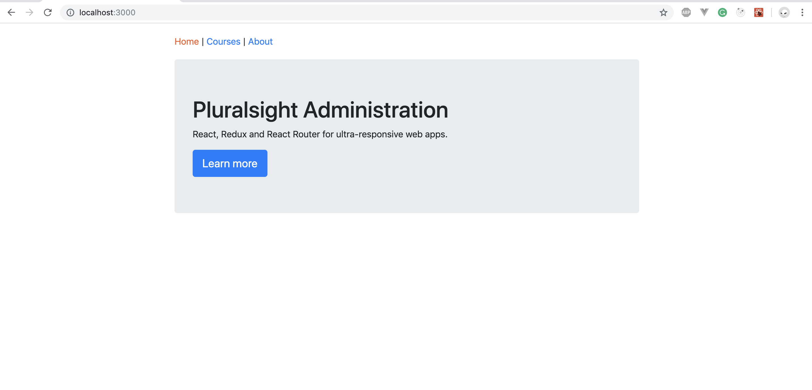
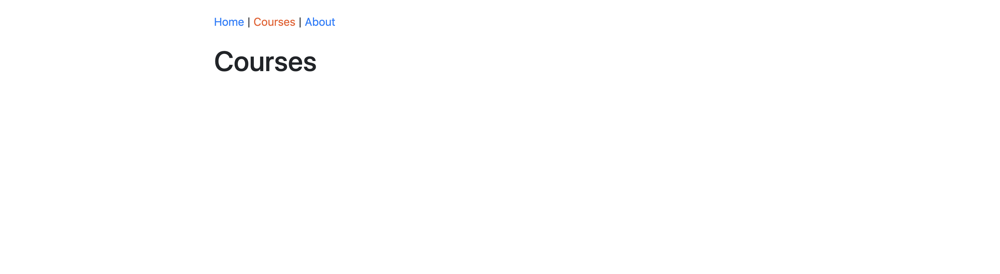
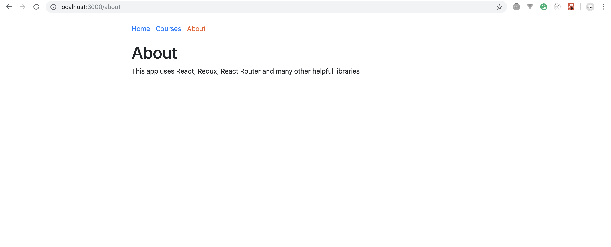
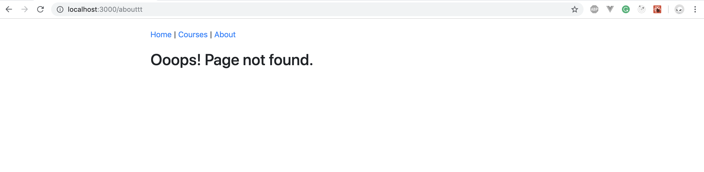

Use [react](https://reactjs.org/docs/getting-started.html) and [react-router](https://reacttraining.com/react-router/web/guides/quick-start) to build the following pages in course-viewer app.

Use bootstrap4 to achieve this styles.

## Home Page


## Courses Page


## About Page


## Page Not Found


### Setup
1. `yarn add bootstrap@4.3.1`
2. Add `import "bootstrap/dist/css/bootstrap.min.css";` in App.js
3. Add Custom css styles in App.css and import in App.js.
    ```
    #root {
    max-width: 1000px;
    margin: auto;
    }
    nav {
    padding: 20px 0;
    }
    ```

### Requirements
1. `Learn More` button takes you to `About Page` from `Home Page`.
2. The Header nav should highlight the page it is on (use: NavLink from react-router).
3. Page not found view is shown if an unknown url is given.