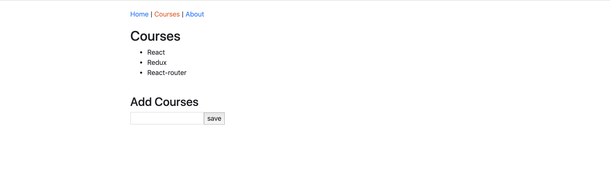

Use React Class components to enhance the courses page.

## Courses Page

### Requirements
1. Add Courses using the form.
2. Store all the courses in React Component State.
3. Show the added courses under Courses.