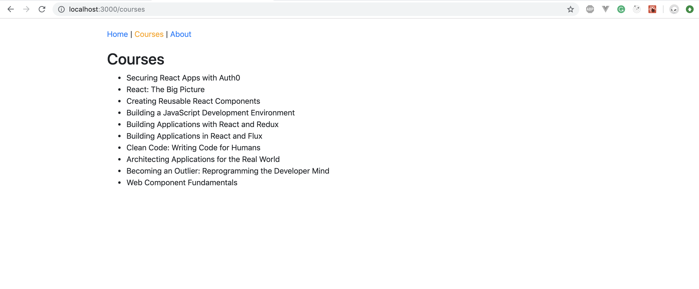

Let's fetch the courses from api and enhance Courses Page.
Make asynchronous call to api using [redux-thunk](https://github.com/reduxjs/redux-thunk#installation)


## Courses Page


### Setup
1. Copy the backend folder into your app root folder.
2. Open backend in a new terminal
3. ```
    cd backend
    node mockData.js
    node apiServer.js
    ```
4. A new server runs on `localhost:3001`
4. Copy api folder into src folder.

### Requirements
1. Use redux-thunk to call api and store the data in redux
2. Show the list of courses in the courses page