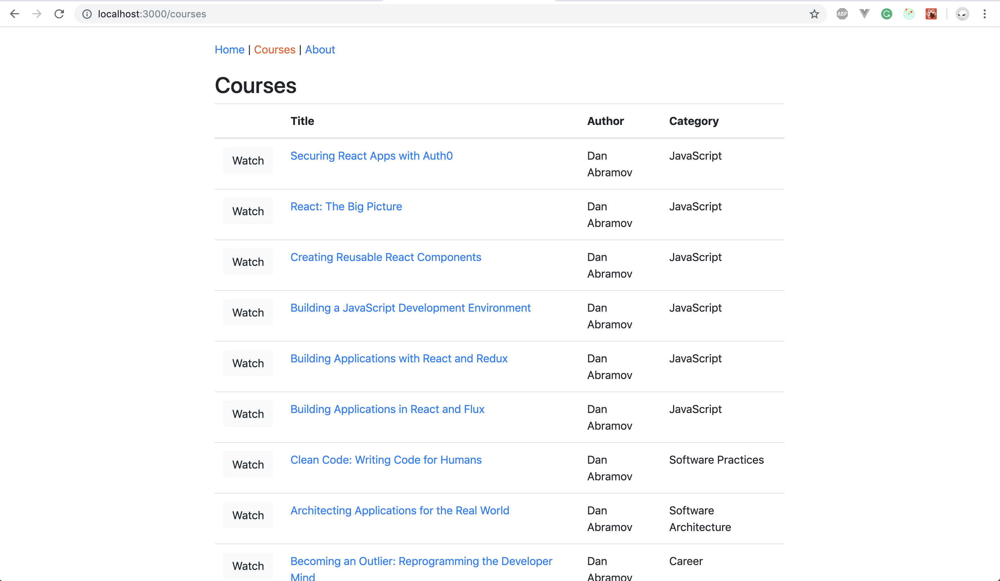
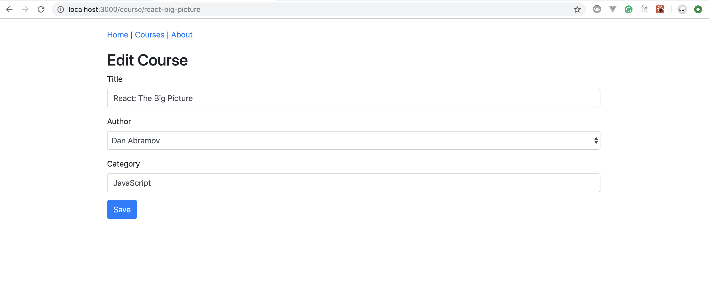

## Courses Page

## Edit Courses

### Requirements
1. The title in the courses table links to `/course/:slug`
2. On clicking the title, it should open the add course page component with "Edit Course" as heading.
3. On clicking the save it should redirect to the updated courses page.